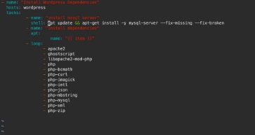
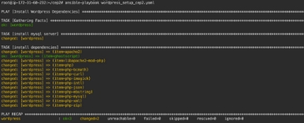
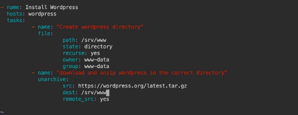
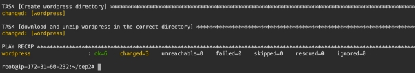
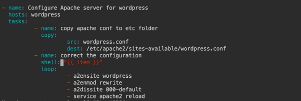
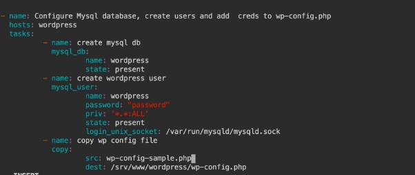
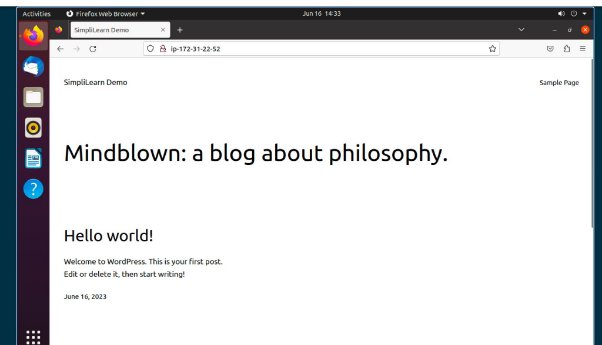

Deployment of WordPress Environment

1. Become root user on the master machine and creat inventory

2. Install Dependencies for Wordpress

● Following guide from here -

<https://ubuntu.com/tutorials/install-and-configure-wordpress#1-overview>

Create a wordpress\_setup\_cep2.yaml playbook in the cep2 directory and create the following tasks in the playbook

3. Install and configure WordPress

Added the below tasks in the yaml file

4. Configure Apache for WordPress

First create a wordpress.conf file on the master machine Add the following code:

<VirtualHost \*:80>

DocumentRoot /srv/www/wordpress <Directory /srv/www/wordpress>

Options FollowSymLinks

AllowOverride Limit Options FileInfo DirectoryIndex index.php

Require all granted

</Directory>

<Directory /srv/www/wordpress/wp-content>

Options FollowSymLinks

Require all granted

</Directory>

</VirtualHost>

and then copy the file to the wordpress machine using the below task and also run the commands to correct the configurations

5. Configure database

Create Mysql Database, create users and add the correct data to wp-config.php file

After running this yaml file

Wordpress installation done!!

